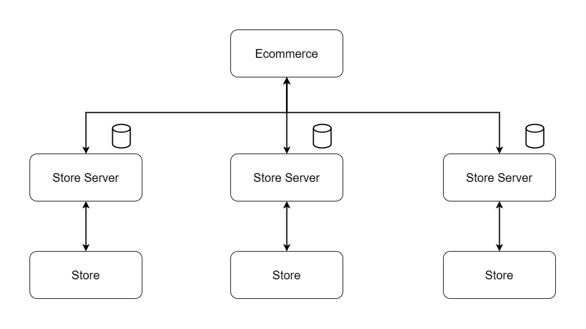
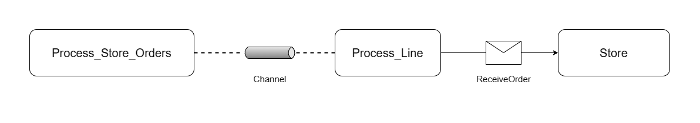
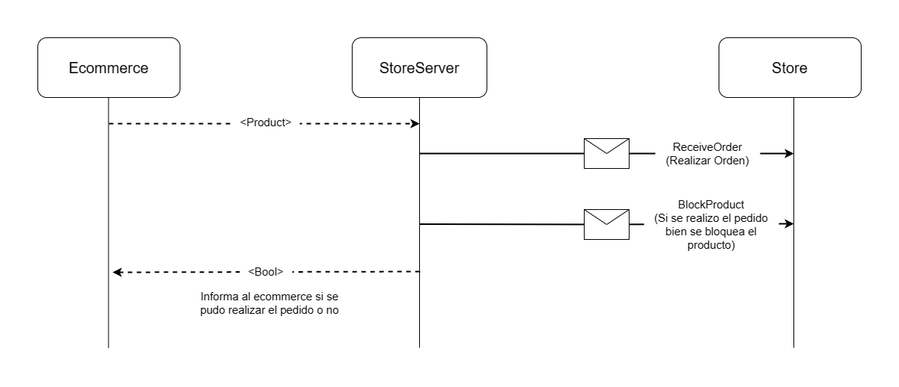

## Introducción

La idea del trabajo es simular la actividad de una red de locales que tiene ventas también a través de un ecommerce. En los locales se pueda atender y realizar pedidos tanto de forma "presencial" mientras que el ecommerce recibe pedidos de forma online y los redirige hacia algún local disponible con stock.

Cada local gestiona su propio inventario. El ecommerce al momento de recibir un pedido realiza una consulta a un local elegido de forma aleatoria para ver si tiene stock. En caso de que el local no tenga stock, pasará a realizar el pedido a otro local y así de forma sucesiva hasta encontrar alguno que tenga o informar que el pedido no se puede realizar. En caso de que sí tenga le envía el pedido al local, el cual luego simula la realización de esta entrega. Esta entrega se realizará o no con éxito de forma aleatoria siguiendo una distribución de bernoulli.

Por otro lado las compras realizadas localmente no tienen esta simulación entrega y simplemente se fijan de que haya stock dentro del local.

A continuación explicaremos detalladamente mejor los distintos modulos del proyecto.



## Store

Para la implementación de los stores se utilizó un modelo de actores.

Cada vez que se quiera levantar un store se le tendrá que pasar por linea de comandos el puerto en el que se levantará de la siguiente forma: `cargo run <puerto>`.

### Actor Store

Una vez iniciada la aplicación se instancia un actor llamado `Store` que se encarga de manejar la lógica de los pedidos y el stock del producto. Su estado interno será el siguiente:

- `products`: un HashMap que contiene los productos en stock que tiene el local. La key corresponde al id del producto.
- `orders_blocked`: un Vec de productos bloqueados que están listos para ser entregados. Estos productos son pedidos hechos por el ecommerce.
- `condv_orders`: es un condvar mediante la cual se avisa a los procesos dedicados a realizar el delivery que hay productos bloqueados para despachar.
- `delivery_process`: es un Vec que guarda el pool de threads dedicados a la entrega de productos.
- `bernoulli_dist`: utilizado para resolver la entrega de un producto.

A su vez este actor contará con los siguientes mensajes:

- `ReceiveOrder`: este mensaje es para recibir un producto que corresponde a un pedido realizado. El mismo contiene el id del producto y la cantidad del pedido del mismo. Nos devolverá un bool dependiendo de si se puede realizar la orden o no
- `BlockProduct`: este mensaje bloquea el producto. Es necesario que se envíe una vez que hayamos tenido la confirmación de `ReceiveOrder` ya que sacará un producto del stock (con su respectiva cantidad) y lo pondrá dentro de `orders_blocked`

### Archivo de ordenes

Para leer y procesar las órdenes del archivo se lanza una task con tokio, la cual irá procesando linea por linea usando el crate de Rust `csv`. Para simular la llegada de pedidos usamos un sleep entre 1 y 5 segundos.

Una vez que se lee la linea se envia mediante un channel creado anteriormente. El rx de este channel se encontrara en otra task, la cual se mantiene en un loop constante recibiendo órdenes y procesandolas, para luego enviar un mensaje al actor store con la orden correspondiente mediante el uso del mensaje `ReceiveOrder`.



### Actor Store Server

Para realizar la comunicación entre el ecommerce y el cliente cada store funciona como un server y el ecommerce funciona como un cliente.

Es por esto que el store se encuentra escuchando conexiones entrantes (provenientes del ecommerce) para poder comenzar a recibir pedidos. Una vez que se establece una conexión se crea una nueva instancia del actor `StoreServer` que se encargará de manejar los datos de entrantes.

El estado interno de este actor va a contar con:

- `write`: la mitad de escritura de un TcpStream que representa nuestra conexión.
- `store_addr`: aca tendremos el address el actor store instanciado anteriormente.

Cuando nos llegue un mensaje lo primero que hacemos es deserializarlo usando el `serde_json`. Una vez deserializado nos queda una variable de tipo Product que corresponde a la orden que se quiere hacer. Con el producto armamos el mensaje `ReceiveOrder` para enviarlo usando el `store_addr`. Como necesitamos esperar a la confirmación de si se puede o no realizar el pedido, para no bloquear el actor sin que pueda llegar otro mensaje, lanzamos una nueva tarea que se encargue de mandar el mensaje y esperar por la respuesta. En caso de que se pueda realizar el pedido lo que hago es enviar el mensaje de `BlockProduct` para notificar que hay un producto para entregar. En este caso informaremos al ecommerce que se pudo tomar el pedido y en caso contrario se informa que no se pudo tomar.



### Lógica del delivery

La lógica del delivery consiste en tener un pool de threads que irán sacando productos de `orders_blocked` para luego determinar si se puede entregar o no el pedido. Cada thread compartirá junto con el actor la condvar `condv_orders`, la lista de productos bloqueados `products` y la lista de ordenes bloqueadas `orders_blocked`.

Cada thread comienza su ejecución ejecutando `wait_while` sobre la condvar a la espera de que haya algun producto para entregar dentro de `orders_blocked`. Cuando un producto es bloqueado ya que se hizo un pedido desde el ecommerce se realiza un `notify_all` sobre esta misma condvar para avisarle a los deliverys que hay un nuevo producto para entregar. El primero en despertarse toma la orden y comienza a realizar la entrega.

Una vez que comienza la entrega simulamos un tiempo de entrega con un sleep aleatorio y usamos la distribuición de bernoulli para determinar si la entrega se pudo realizar correctamente. En caso afirmativo se informa y se vuelve a la espera de que haya algun producto a entregar. Caso contrario se informa que no se pudo entregar y se coloca el producto de nuevo en stock para luego esperar por una nueva orden.

### Mostrar el estado del programa

Para mostrar el estado en el que se encuentran el Store utilizamos distintos prints que informaran como se van procesando y realizando los distintos pedidos. A continuacion describiremos algunos.

Con respecto a las ordenes locales tendremos los siguientes mensajes:

```
[LINE PROCESS] Procesando línea: StringRecord([<product_id>, <amount>])
------------------------------------------------------------------------
[ACTOR STORE] Recibi un pedido de <product_id> con una cantidad <amount>
------------------------------------------------------------------------
[ACTOR STORE] Se encontro el producto
------------------------------------------------------------------------
[ACTOR STORE] Producto disponible para entregar
------------------------------------------------------------------------
[ACTOR STORE] No hay la cantidad requerida
------------------------------------------------------------------------
[ACTOR STORE] No se encontro el producto
```

Con respecto a los mensajes que tienen que ver con un pedido hecho por el ecommerce podemos observar lo siguiente:

```
[ACTOR STORE SERVER] Recibi un mensaje: {"id":<product_id> ,"amount":<amount> ,"stores":[]}
------------------------------------------------------------------------
[ACTOR STORE SERVER] ID: <product_id> , Amount: <amount>
------------------------------------------------------------------------
[ACTOR STORE] Recibi un pedido de <product_id> con una cantidad <amount>
------------------------------------------------------------------------
[ACTOR STORE] Se encontro el producto
------------------------------------------------------------------------
[ACTOR STORE] Producto disponible para entregar
------------------------------------------------------------------------
[ACTOR STORE] No hay la cantidad requerida
------------------------------------------------------------------------
[ACTOR STORE] No se encontro el producto
------------------------------------------------------------------------
[ACTOR STORE] Producto bloqueado
------------------------------------------------------------------------
[DELIVERY N] Comenzamos el delivery del producto
------------------------------------------------------------------------
[ACTOR STORE SERVER] Pedido bloqueado exitosamente
------------------------------------------------------------------------
[DELIVERY N] Se pudo entregar correctamente el producto <product_id>
```

## Ecommerce

Para iniciar el e-commerce simplemente se debe correr `cargo run`. Es indispensable que dentro de la carpeta `ecommerce` existan dos archivos csv:

- `pedidos.csv`: Los pedidos que se realizan mediante el e-commerce en formato id,amount siendo el id del producto, y la cantidad
- `stores.csv`: Los stores existentes o disponibles para trabajar en formato id,address siendo el id de la tienda y la direccion IP a la que se debe conectar

Una vez que se inicializa el e-commerce, lee esos archivos, almacena los pedidos y debe conectarse a los stores para poder asignarle los mismos.

### Archivo de ordenes

Para leer el archivo de pedidos se utiliza el modelo fork join al momento de procesar las lineas. Esto quiere decir que se lee el archivo y se lanza una tarea para cada linea que se encarga de parsearlas y crear el Product con su correspondiente Id y Amount

### Conexión y Gestión de pedidos con Stores

Para el manejo de la conexión con los stores, se creo una estructura fundamental llamada SharedState que representa el estado compartido dentro de una conexión. Contiene dos atributos:

- `products_to_deliver`: Vector de Mutex Product que representa los productos que deben ser gestionados por un store
- `condvar`: Condvar para notificar a los hilos que hay productos para procesar

Entonces, para manejar las conexiones se utiliza un vector de las IDs de los stores y un hashMap que tenga como key la ID del store, y como valor su correspondiente SharedState.
Luego, se lanza un hilo que se encarga de realizar la conexión y gestionar la entrega de productos del store a traves de la funcion `handle_store_connection`:

Esta función tiene dos loops, el primero se encarga de realizar la conexión TCP con el store, en caso de no conseguirlo vuelve a intentarlo a los 10 segundos. El segundo loop se encarga de esperar a la CondVar del SharedState para que le avise que hay un pedido asignado a esa tienda.
Cuando llega una señal, recibe el pedido e intenta enviarlo por el stream TCP. En caso de que el store se haya desconectado de la red se rompe el loop y vuelve al primero hasta que se logre reconectar. Por otro lado, si se envia correctamente, se queda escuchando en el stream la respuesta del store, el cual debe avisar si tiene o no más stock del producto. Si se da esto último se debe buscar otra store que tenga disponible, asignarle el pedido en su SharedState y notificarle a su CondVar.

Una vez que se lanzaron todas las tasks, cada pedido se asigna aleatoriamente a una store agregandolo en su SharedState y notificando a su CondVar

### Mostrar el estado del programa

Para mostrar el estado en el que se encuentran el E-commerce utilizamos distintos prints que informaran como se encuentran las conexion con los stores y como se van procesando los distintos pedidos .

Con respecto a las conexion con los stores tenemos los siguientes mensajes:

```
[E-COMMERCE] Intentando conectar al Store <store_id>: <store_address>
------------------------------------------------------------------------
[E-COMMERCE] [Store <store_id>] Conexión exitosa al store: <store_address>
------------------------------------------------------------------------
[E-COMMERCE] [Store <store_id>] Error al intentar conectar al store: Connection refused

```

Ahora en cuanto a los pedidos y gestion se tienen los siguientes mensajes:

```
[E-COMMERCE] <pedidos_quantity> products read
------------------------------------------------------------------------
[E-COMMERCE] [Store <store_id>] Processing product
------------------------------------------------------------------------
[E-COMMERCE] [Store <store_id>] Producto enviado exitosamente: {"id":<product_id>,"amount":<product_amount>,"stores":[]}
------------------------------------------------------------------------
[E-COMMERCE] [Store <store_id>] No se encuentra stock en el local pedido. Pido en otro

```

## A mejorar

- Procesar el archivo de pedidos en el store de manera concurrente.
- Levantar los stocks de un archivo.
- Hacer que el proceso de forma concurrente del archivo de pedidos en el ecommerce sea con N threads y no con igual cantidad de threads que de líneas del archivo.
- En este momento si cuando se está enviando un pedido se cae la conexión ese pedido se toma como que se envió de manera correcta cuando puede no ser así.
- Si está caída la conexión a un store redirigir el pedido a otro después de cierto tiempo.
